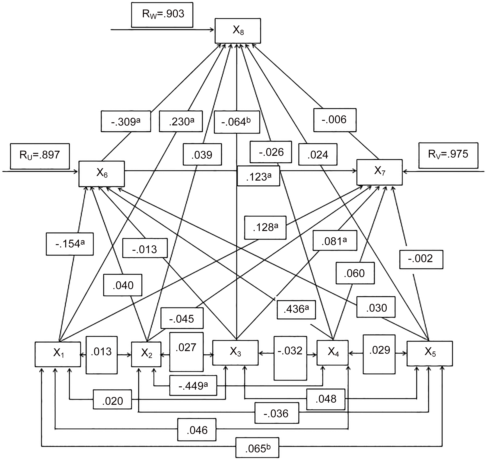
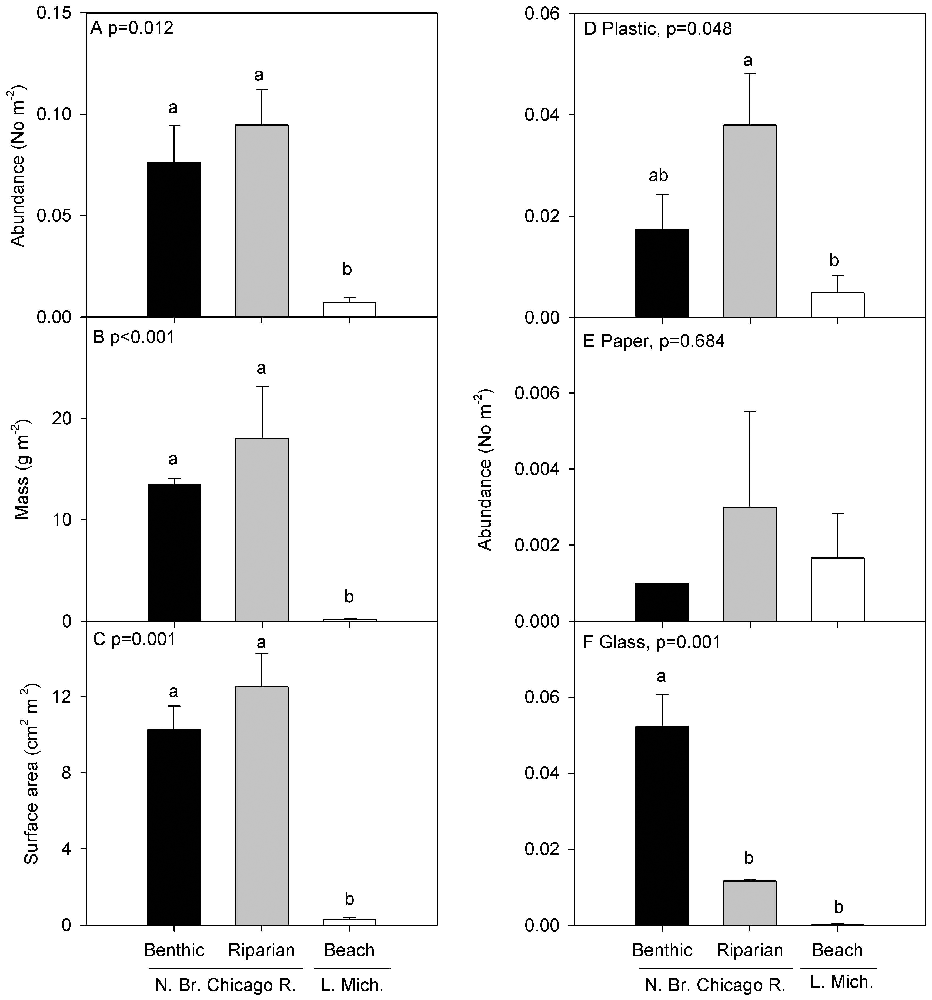
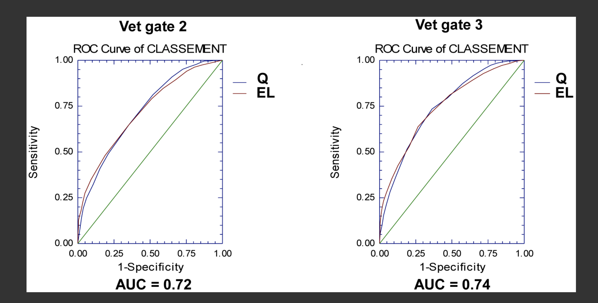

## README for HW5_ri619 

### Assignment 1:
### __________________________________________________________________________________

   On this assigment, we analyzed the hypothesis and data cleaning submitted by a random classmate. I was assigned Junjie Cai's work where they hypothesized that ride duration does not change from night to day.
   
   
### Assignment 2:
### __________________________________________________________________________________

   Assignment 2 called for us to find research papers on Plos One that utilized some of the statistical tests we have been learning in class. I worked with Sarah June Sachs and Andrew Hill on this part of the assignment. I did research into Path Analysis, Sarah found a paper that used ANOVA and Andrew found a paper using Logistic Regression. The table and corresponding plots are below. 
   

### Assignment 3:
### __________________________________________________________________________________

   Assignment 3 asked us to reproduce analysis done into the NYC Post-Prison Employment program. The main crux of the assignment was to learn how to utilize two types of tests, Z-test and Chi Square test. The two questions we looked at were "the difference in rates of former prisoners employed in a CEO position with/without the program" and "the difference in recidivism rates for former prisoners within 1-3 years of release"
   

### Assignment 4:
### __________________________________________________________________________________

   Using Citibike data, in this assignment we ask two questions, "Is there a difference in trip duration between night and day" and (As EC) "Is there a difference in age between rides starting in Manhattan and in Brooklyn". For each question, we must use the following tests: K-S test, Pearson's test, and Spearman's test. In all cases, these tests determine the similarities between two datasets. 

| **Statistical Analyses**	|  **IV(s)**  |  **IV type(s)** |  **DV(s)**  |  **DV type(s)**  |  **Control Var** | **Control Var type**  | **Question to be answered** | **_H0_** | **alpha** | **link to paper**| 
|:----------:|:----------|:------------|:-------------|:-------------|:------------|:------------- |:------------------|:----:|:-------:|:-------|
Path Analysis	| 1 - Age of Women  2 - Place of residence  3 - Religion  4 - Socioeconomic Status  5 - Family planning methods | 1-3 categorial, 4-5 ordinal | 1 - Unwanted births . 2 - women education . 3 - Age at first marriage| 1-3 categorical | NA | NA | What are the determinants of unwanted births in Bangladesh | Sociodemographic variable has direct/indirect effect on the likelyhood of an unwanted birth  | 0.05 and 0.01 | [Correlates of Unwanted Births in Bangladesh: A Study through Path Analysis](https://journals.plos.org/plosone/article?id=10.1371/journal.pone.0164007#pone-0164007-t002) |
  |||||||||
  ANOVA    | 1, Anthropomorphic Litter Density in Urban Freshwater | continuous | 3, Ecosystem types: 1)Chicago River Benthic zone   2)Riparian Zone   3) Lake Michigan Beach | categorical | none | none |     Is there a significant difference of AL density between three ecosystems? | µ1 = µ2 = µ3 | ≤ 0.012 | [Anthropogenic Litter in Urban Freshwater Ecosystems: Distribution and Microbial Interactions](https://journals.plos.org/plosone/article?id=10.1371/journal.pone.0098485#s3) |
  
  Logistic Regression    | 3, Cardiac Recovery Time, Heart Rate, Average Speed | Numerical | 1, Qualified/Eliminated| categorical | Distance travelled, Age | Numerical | Can Cardiac Recovery Time, Heart Rate, and Average Speed accurately predict whether or not horses will be eliminated from endurance competitions | This model accurately predicts less than or equal to 50% of outcomes | 0.5 | [Speed and Cardiac Recovery Variables Predict the Probability of Elimination in Equine Endurance Events](https://journals.plos.org/plosone/article?id=10.1371/journal.pone.0137013) |
 |||||||||

